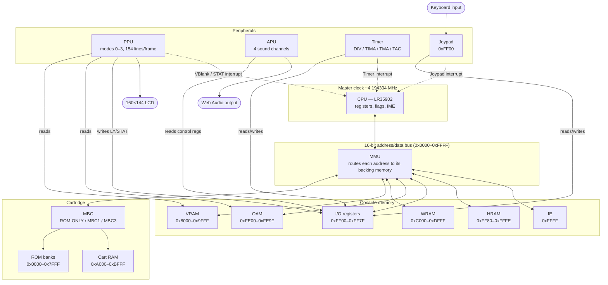

# JS GB Emulator

A from-scratch, single-file DMG (original Game Boy) emulator written in plain JavaScript. Built as an educational reference demonstrating how the LR35902 CPU, PPU, and memory map work together to turn a ROM file into a running game.

**This project is intended for educational use** — for learning how a real CPU/PPU/memory bus fits together, not as a polished player. Alongside normal emulation, it exposes the machine's internals as you go:

* **Live execution traces:** step through decoded instructions as the CPU fetches and runs them, with register and flag values updated in real time.
* **Memory inspection:** browse live RAM/VRAM/OAM/I/O contents and an interactive map of the full `0x0000`–`0xFFFF` address space, showing which region backs which address.
* **MBC bank-switching visualizer:** watch cartridge ROM/RAM banks swap in and out of the CPU's address window as a game writes to mapper control registers.
* **PPU/CPU debug panel:** trace register flags and other live status details while a ROM runs.

## Features

* **Complete CPU implementation:** Full DMG CPU instruction set (LR35902) including bit-field decoding grids and CB-prefixed operations.
* **Pixel Processing Unit (PPU):** Support for background, window, and sprite layers with real hardware line limits.
* **Cartridge mappers:** Built-in memory management unit supporting ROM-only, MBC1, and basic MBC3 cartridges.
* **Peripherals:** Integrated hardware timer loops (DIV/TIMA/TMA/TAC) and joypad register logic.
* **Audio:** All four APU sound channels (two pulse channels, a wave channel, and a noise channel) synthesized live through the Web Audio API.
* **Zero dependencies:** Everything fits inside a standalone HTML/JS page with an interactive web UI, including a debug panel and visualizers for the memory map and MBC bank switching.

## Scope limitations

To maximize source code readability for students, the following features are intentionally omitted:
* Game Boy Color (GBC).
* Sub-instruction cycle-exact PPU, timer, or APU edge cases.

Scope note: this implements the full DMG CPU instruction set, background/window/sprite rendering, timers, joypad input, sound (all 4 APU channels via Web Audio), and ROM-only / MBC1 / basic MBC3 cartridges — enough to run many real games. It intentionally leaves out GB Color features and cycle-exact PPU/timer/APU edge cases to keep the source readable as a learning reference.

Read the heavily commented source (view page source) to see how each piece works.

## Glossary

Quick reference for the jargon used throughout this README and the app's UI — come back here any time an abbreviation doesn't ring a bell.

| Term | Meaning |
|---|---|
| **T-cycle** ("dot") | One tick of the Game Boy's 4.194304 MHz master clock — the smallest unit of time on the hardware, ~0.238µs. |
| **M-cycle** (machine cycle) | 4 T-cycles. Most instruction-timing figures in Game Boy docs are given in M-cycles, since almost everything the CPU does takes a whole number of them. |
| **CPU (LR35902)** | The Game Boy's processor — a Sharp-built hybrid of the Intel 8080 and Zilog Z80 instruction sets. |
| **PPU** (Pixel Processing Unit) | The chip that reads VRAM/OAM and turns them into the 160×144 pixel image, one scanline at a time. |
| **APU** (Audio Processing Unit) | The 4-channel sound generator (two pulse channels, one wave channel, one noise channel). |
| **MMU** (Memory Management Unit) | The logic that routes every CPU memory access to the right physical RAM/ROM/register bank. |
| **MBC** (Memory Bank Controller) | A chip inside the cartridge that swaps 16KB/8KB "banks" of ROM or RAM into the CPU's fixed address windows, letting games exceed the CPU's directly-addressable 32KB. |
| **ROM/RAM bank** | A fixed-size (16KB ROM / 8KB RAM) chunk of cartridge memory an MBC can map into the CPU's address space in place of another bank. |
| **VRAM** (Video RAM) | `0x8000`–`0x9FFF`. Holds tile graphics data and the two background tile maps. |
| **OAM** (Object Attribute Memory) | `0xFE00`–`0xFE9F`. A 40-entry table describing every sprite's position, tile, and flags. |
| **HRAM** (High RAM) | `0xFF80`–`0xFFFE`. A small scratch-RAM region that stays accessible even during OAM DMA — the reason DMA-wait routines are copied there before running. |
| **WRAM** (Work RAM) | `0xC000`–`0xDFFF`. General-purpose RAM for game state, not directly tied to graphics or sound hardware. |
| **DMA** (Direct Memory Access) | A hardware-driven bulk copy — here, the OAM DMA transfer that copies 160 bytes from ROM/RAM into OAM in 160 M-cycles, without the CPU executing one instruction per byte. |
| **LCDC** | `0xFF40`. The master PPU control register — screen on/off, which layers are enabled, tile data/map addressing. |
| **STAT** | `0xFF41`. Reports the PPU's current mode (0–3) and configures which PPU events raise the STAT interrupt. |
| **SCX / SCY** | Background scroll-X / scroll-Y registers — which 160×144 window of the 256×256 background tilemap is currently visible. |
| **WX / WY** | Window layer X/Y position registers. |
| **BGP / OBP0 / OBP1** | Palette registers mapping each tile's 2-bit color index to one of the DMG's four on-screen shades — one palette for background/window, two for sprites. |
| **DIV / TIMA / TMA / TAC** | The timer registers: a free-running divider, a configurable counter, its reload value, and its control/rate-select register. |
| **IE / IF** | Interrupt Enable (`0xFFFF`) and Interrupt Flag/request (`0xFF0F`) registers — a bit set in *both* is what actually triggers an interrupt. |
| **IME** | Interrupt Master Enable — a CPU-internal flag (not memory-mapped) that gates all interrupts on or off, toggled by `EI` / `DI` / `RETI`. |
| **LFSR** (Linear-Feedback Shift Register) | The pseudo-random bit generator driving the noise channel (CH4) — its shifting pattern is what makes noise sound "noisy" rather than musical. |
| **Duty cycle** | For a pulse/square-wave channel, what fraction of each period the signal is "high" vs "low" — changes the wave's timbre (thin vs buzzy). |
| **Envelope** | A per-channel volume-over-time shape (e.g. fade in, fade out) applied automatically by the APU hardware, no CPU intervention needed once configured. |
| **Sweep** | Channel 1's automatic, hardware-driven frequency slide — the classic laser/power-up pitch-bend effect. |
| **Tile** | An 8×8 pixel graphic block, the basic unit background/window/sprite graphics are built from. |
| **Tilemap** | A 32×32 grid of tile-index bytes describing which tile goes where to build the background or window layer. |

## How a Game Boy actually works

The original Game Boy (codenamed "DMG", for "Dot Matrix Game") is built around four cooperating pieces of hardware: a CPU that executes game code, a PPU that turns video RAM into pixels, an APU that generates sound, and a memory bus that ties everything — including the cartridge — together. Real hardware runs all of this in lockstep at a master clock of ~4.194304 MHz; this emulator reproduces that by stepping the PPU, timer, and APU forward by however many clock cycles each CPU instruction took, once per instruction, so every component stays in sync.



### 1. The CPU — Sharp LR35902

The LR35902 is a hybrid chip, roughly an Intel 8080 core with some Zilog Z80 instructions mixed in (and a few Z80 features, like an alternate register set, left out). It exposes:

* **Eight 8-bit registers** — `A, B, C, D, E, H, L`, plus a flags register — that are frequently paired up into four 16-bit "virtual" registers: `AF`, `BC`, `DE`, and `HL`. `HL` in particular is used constantly as a pointer into memory (e.g. `LD (HL), A` writes `A` to the address `HL` holds).
* **Two 16-bit pointers**: the **Stack Pointer (`SP`)**, used for `PUSH`/`POP` and `CALL`/`RET`, and the **Program Counter (`PC`)**, which always holds the address of the next instruction to fetch.
* **Four flag bits** in the low nibble of `F`: **Z** (zero — set when a result is 0), **N** (subtract — tracks whether the last op was addition or subtraction, used by `DAA`), **H** (half-carry — carry out of bit 3, needed for BCD correction), and **C** (carry — carry/borrow out of bit 7).
* **An instruction set decoded in two grids**: the base opcode table (`0x00`–`0xFF`) and a second table reached via the `0xCB` prefix byte, which holds all the single-bit test/set/reset and rotate/shift operations (e.g. `BIT 7, H`, `SET 3, (HL)`, `SRL A`).
* **Interrupts**, gated by the **IME** (Interrupt Master Enable) flag. Five interrupt sources exist — VBlank, LCD STAT, Timer, Serial, and Joypad — each with its own bit in the `IE` (enable) and `IF` (flag/request) registers at `0xFFFF` and `0xFF0F`. `EI` famously doesn't take effect until *after* the instruction following it has executed, a quirk this emulator models explicitly with an `eiDelay` counter.

At power-on, the boot ROM has already run and left the CPU in a known state before handing off to the cartridge at address `0x0100`: `AF=0x01B0, BC=0x0013, DE=0x00D8, HL=0x014D, SP=0xFFFE, PC=0x0100`, with `Z`, `H`, and `C` all set. Emulators that skip the actual boot ROM image (as this one does) simply initialize the registers to these values directly and jump straight to `0x0100`.

**Example — a tiny loop the CPU might execute:**
```
LD  A, 0x05      ; A = 5
loop:
DEC A            ; A = A - 1   (sets Z when A hits 0, sets N)
JR  NZ, loop      ; jump back to `loop` while Z is not set
```
This decrements `A` from 5 to 0, looping four times before falling through — the same kind of tight timing loop real games use to wait out a fixed number of cycles.

> **💡 Try this:** Pause the emulator and use the single-step debugger to execute one instruction at a time. Watch the flags (`Z`/`N`/`H`/`C`) and `PC` update after each step, and see how a conditional jump like `JR NZ` reads `Z` to decide whether to branch.

### 2. Memory map

The CPU sees a single flat 16-bit address space (`0x0000`–`0xFFFF`), but different address ranges are physically backed by different hardware — cartridge ROM, cartridge RAM, the console's own work RAM, video RAM, and memory-mapped I/O registers:

| Range | Region |
|---|---|
| `0x0000`–`0x3FFF` | ROM bank 0 (fixed) |
| `0x4000`–`0x7FFF` | ROM bank N (switchable via the mapper) |
| `0x8000`–`0x9FFF` | Video RAM (tile data + tile maps) |
| `0xA000`–`0xBFFF` | Cartridge RAM (switchable, if present) |
| `0xC000`–`0xDFFF` | Work RAM |
| `0xFE00`–`0xFE9F` | OAM (sprite attribute table) |
| `0xFF00`–`0xFF7F` | I/O registers (joypad, timer, PPU, sound, etc.) |
| `0xFF80`–`0xFFFE` | High RAM ("HRAM"), fast scratch space |
| `0xFFFF` | Interrupt Enable register |

> **💡 Try this:** Open the Memory Map visualizer while a game runs and watch which regions light up as you play. ROM reads happen constantly as the CPU fetches code; VRAM writes cluster during V-Blank, when it's safe for the game to touch graphics data.

### 3. Cartridges and memory bank controllers (MBCs)

A Game Boy cartridge is just ROM (and sometimes battery-backed RAM) — but most games are bigger than the 32 KB the CPU can address directly at once. A **mapper chip** inside the cartridge sits between the CPU and the ROM/RAM chips and remaps ("banks") different 16 KB or 8 KB chunks into the CPU's visible address windows whenever the game writes to specific "control" addresses. This emulator's MMU recognizes the cartridge header byte at `0x0147` and implements:

* **ROM ONLY** (type `0x00`) — no banking at all; the whole 32 KB ROM is just mapped in directly.
* **MBC1** (types `0x01`–`0x03`) — the most common mapper. Writing to `0x2000`–`0x3FFF` selects the ROM bank visible at `0x4000`–`0x7FFF`; writing to `0x4000`–`0x5FFF` selects either the RAM bank or the upper ROM bank bits, depending on a banking-mode bit set via `0x6000`–`0x7FFF`.
* **MBC3** (types `0x0F`–`0x13`) — similar bank-select scheme to MBC1, plus support for larger ROM/RAM sizes and (on real hardware) a real-time-clock chip.

**Example:** if a 512 KB game writes the value `0x05` to address `0x2000`, the MBC1 logic swaps ROM bank 5 into the `0x4000`–`0x7FFF` window, so the next instruction fetched from, say, `0x4010` now comes from byte `5 × 0x4000 + 0x0010` of the ROM file rather than bank 1. The in-app "MBC Banking" visualizer shows exactly this happening in real time as a loaded game runs.

> **💡 Try this:** Load a game bigger than 32 KB and watch the MBC Banking visualizer as you play. Different areas, cutscenes, or menus often trigger a bank switch — see which ROM bank ends up mapped into `0x4000`–`0x7FFF` and when.

### 4. The PPU (Pixel Processing Unit) and how a frame is drawn

The Game Boy's LCD is 160×144 pixels with a 4-shade grayscale (or green-tinted, on original DMG hardware) palette. The PPU builds each frame line-by-line, cycling through four modes for every one of the 154 scanlines (144 visible + 10 vertical blank):

1. **Mode 2 — OAM search** (80 cycles): scans the 40-entry sprite table (OAM, at `0xFE00`–`0xFE9F`) to find up to 10 sprites that intersect the current line.
2. **Mode 3 — pixel transfer** (~172–289 cycles): actually draws the line, compositing background, window, and sprite pixels together.
3. **Mode 0 — HBlank**: idle time padding the line out to a fixed total length, during which the CPU may safely modify VRAM/OAM without visual corruption.
4. **Mode 1 — VBlank** (10 scanlines' worth): after all 144 visible lines are drawn, the PPU fires the VBlank interrupt and idles, giving the game a safe window to update graphics data for the next frame.

The three layers composited each line are:
* **Background** — a scrollable 256×256 pixel tilemap (scrolled via the `SCX`/`SCY` registers) built from 8×8 pixel tiles stored in VRAM.
* **Window** — a second, non-scrolling tile layer (positioned via `WX`/`WY`) typically used for HUDs and status bars, drawn on top of the background.
* **Sprites (objects)** — up to 40 movable 8×8 or 8×16 pixel entities read from OAM, each with its own tile, position, and palette/flip flags, with a hardware limit of 10 visible per scanline (a real limitation this emulator reproduces, so too many sprites on one line will flicker or vanish just like on real hardware).

All of this is driven by `LCDC` (`0xFF40`, the master on/off and layer-enable register), `STAT` (`0xFF41`, current mode + interrupt sources), and the palette registers `BGP`/`OBP0`/`OBP1` (`0xFF47`–`0xFF49`), which map each tile's 2-bit color index to one of the four on-screen shades.

> **💡 Try this:** Open the Scanline Timeline tool and watch the current-line playhead race through Mode 2 → Mode 3 → Mode 0, line after line. Then switch to the Tile Map view and watch the yellow 160×144 viewport box move across the full 256×256 background as `SCX`/`SCY` change during gameplay.

### 5. Timers

A free-running **`DIV`** register (`0xFF04`) increments continuously at 16384 Hz and resets to 0 whenever written. A separate, configurable **`TIMA`** counter (`0xFF05`) increments at a rate chosen by `TAC` (`0xFF07`), and fires a Timer interrupt and reloads itself from `TMA` (`0xFF06`) whenever it overflows past `0xFF` — the basic mechanism games use for time-based logic (animation timing, frame pacing, etc.) independent of the PPU.

> **💡 Try this:** Watch `DIV` and `TIMA` in the CPU/PPU debug panel side by side. `DIV` ticks at a fixed rate no matter what; `TIMA`'s rate depends entirely on whatever `TAC` value the currently-running game has chosen — they're deliberately independent clocks, not one derived from the other.

### 6. Joypad input

A single register at `0xFF00` is read twice by software, once with a "select buttons" bit set (to read A/B/Select/Start) and once with a "select d-pad" bit set (to read Up/Down/Left/Right) — the same four physical input lines are multiplexed to report both button groups. Bits read `0` when the corresponding button is held, `1` when released.

> **💡 Try this:** Hold a direction key and watch the joypad register value in the debug panel — notice specific bits go *low*, not high. It's an easy thing to get backwards when writing your own emulator or homebrew.

### 7. Sound (APU)

The Audio Processing Unit mixes four independent channels into stereo output, each with its own enable/length/volume/frequency controls in the `0xFF10`–`0xFF3F` register range:

* **Channel 1 & 2 — Pulse/square wave**, each with programmable duty cycle and a volume envelope; channel 1 additionally supports a frequency sweep effect (rising/falling pitch, as heard in classic power-up or laser sound effects).
* **Channel 3 — Custom wave**, playing back a 32-sample, 4-bit waveform the game writes directly into "Wave RAM" (`0xFF30`–`0xFF3F`) — used for melodic instrument-style sounds.
* **Channel 4 — Noise**, driven by a linear-feedback shift register (LFSR) rather than a waveform, used for percussion and explosion-style effects.

This emulator synthesizes all four channels live and streams them to the Web Audio API, matching the AudioContext's actual sample rate at runtime rather than assuming a fixed 44.1 kHz, since that varies by OS and hardware.

> **💡 Try this:** Open the Oscilloscope while a game's music plays and watch all four channels at once — CH1/CH2's square waves (and CH1's sweep bending the pitch), CH3's custom wave shape, and CH4's noisy LFSR output. A flat line means that channel is currently off.

### 8. Putting it all together: what every part does every second, frame, and line

Real hardware runs everything off one master clock (4.194304 MHz = 4,194,304 T-cycles per second), but each component reacts to that clock completely differently — some are locked to the PPU's frame/line structure, others (the timer, the APU's audio sampling) tick on their own independent schedules that don't care what's on screen. Zooming in from a full second down to a single scanline, here's what each piece is actually doing:

**Every second (~59.73 times):**
* **CPU** — executes on the order of 180,000–360,000 instructions in total (roughly 3,000–6,000 per frame × ~59.73 frames), dispatching whatever V-Blank/STAT/Timer/Serial/Joypad interrupts arrive along the way.
* **PPU** — completes ~59.73 full frames (4,194,304 ÷ 70,224 T-cycles/frame) — the Game Boy's native refresh rate, not a clean 60Hz.
* **Timer** — `DIV` (`0xFF04`) increments 16,384 times off its own fixed divider, completely independent of what the CPU or PPU are doing; `TIMA` increments at whatever rate `TAC` selects, firing a Timer interrupt (and reloading from `TMA`) each time it overflows.
* **APU** — the 512 Hz frame sequencer ticks 512 times, clocking length counters at 256 Hz (256 times), the CH1 sweep unit at 128 Hz (128 times), and volume envelopes at 64 Hz (64 times) — see `clockFrameSequencer()`. Meanwhile the sample generator produces one output sample per channel at whatever rate the browser's `AudioContext` requests (typically 44.1kHz or 48kHz) — a rate that has nothing to do with the emulated GB clock.
* **Memory/MBC** — any ROM/RAM bank switch takes effect the instant the CPU executes the mapper-control write that triggers it; there's no fixed cadence, unlike the PPU/timer/APU above.
* **Joypad** — reacts to real key presses/releases whenever they happen in the browser, asynchronously to CPU/PPU timing; each new press can fire a Joypad interrupt on the spot.

**Every frame (70,224 T-cycles, ~16.74ms):**
* **CPU** — runs (`Emulator.runFrame()`) until it has spent exactly 70,224 T-cycles, which works out to roughly 3,000–6,000+ instructions depending on which ones ran and how much of the frame it spent HALTed waiting for the next interrupt.
* **PPU** — steps through all 154 scanlines (144 visible, lines 0–143, 93.5% of the frame + 10 V-Blank, lines 144–153, 6.5%) and fires exactly one V-Blank interrupt, at the start of line 144 — the signal games use to know "the picture is done, it's safe to update graphics data now."
* **Timer** — `DIV` increments ~274 times per frame (16,384 Hz ÷ 59.73 Hz); `TIMA` increments some multiple of that depending on `TAC`.
* **APU** — the frame sequencer advances ~8.6 steps; roughly 740–800 audio samples get generated (at 44.1–48kHz) to keep the audio buffer fed — a rate set entirely by the sound card, not by anything happening on screen this frame.
* **Memory/MBC** — most games perform whatever ROM/RAM bank switches that frame's logic needs here, plus (if used) exactly one OAM DMA transfer — 160 M-cycles = 640T (~0.9% of the frame) — typically triggered right after the V-Blank interrupt, since the CPU can only touch HRAM while it runs.
* **Joypad** — no automatic activity; the register just reflects whatever's currently held whenever the CPU reads it.

**Every line (456 T-cycles, ~108.7µs):**
* **CPU** — keeps fetching and executing instructions exactly as it does at any other moment; nothing about "being on a scanline" changes how the CPU runs, except which memory (VRAM/OAM) is safe to touch, which depends on the PPU's current mode.
* **PPU** — visible lines (0–143) cycle through **Mode 2 – OAM Search** (80T) → **Mode 3 – Pixel Transfer** (172T) → **Mode 0 – H-Blank** (204T); V-Blank lines (144–153) are **Mode 1** for their whole 456T, with no drawing at all. A STAT interrupt can optionally fire on specific lines (an LYC match or mode-change condition) — the mechanism behind mid-frame scroll tricks and split-screen effects.
* **Timer** — `DIV`/`TIMA` keep incrementing at their own rate regardless of which scanline the PPU is on; they're fully decoupled from PPU timing.
* **APU** — keeps generating samples at its own independent rate; a scanline boundary has no special meaning to the sound hardware whatsoever.
* **Memory/MBC** — a bank switch or DMA start can happen on any line the CPU's code is running on; what changes is the *consequence* — e.g. writing VRAM/OAM during Mode 3 (or while OAM DMA is active) can corrupt that line's output, a real hardware quirk rather than a bug.
* **Joypad** — same story: fully decoupled from scanline timing, polled purely whenever the CPU happens to read the register.

> **💡 Try this:** Open Frame Activity, click through a few recent frames on the left, then click a scanline in "Anatomy of frame" to drill all the way into that single line's 456T breakdown in "Anatomy of line" below it. Compare a visible line against a V-Blank line to see the mode split disappear entirely — then check the CPU/PPU debug panel's `DIV`/`TIMA` values and the Oscilloscope at the same moment, to see that neither one so much as blinks at the line boundary you just picked.

## MBC reference: every known Game Boy mapper

This emulator only implements **ROM ONLY**, **MBC1**, and **MBC3** (see [Scope limitations](#scope-limitations)), but real cartridges used a much wider range of mapper chips. This table is a reference for the full landscape — useful context if you're extending this project's MMU or just curious how your favorite game saved its progress. Percentages are rough estimates from cartridge-database surveys, not an official figure, since no definitive count of the full library-by-mapper exists.

| Mapper | Implemented here? | Max ROM | Max RAM | RTC | Rumble | ~% of library | Example games |
|---|---|---|---|---|---|---|---|
| **ROM ONLY** | ✅ | 32 KB | 8 KB (optional) | No | No | ~2-3% | *Tetris*, *Alleyway* |
| **MBC1** | ✅ | 2 MB (125 usable banks — banks `0x20`/`0x40`/`0x60` are unreachable due to a hardware quirk) | 32 KB | No | No | ~35-40% | *Pokémon Red/Blue*, *Super Mario Land 2*, *Zelda: Link's Awakening*, *Kirby's Dream Land 2* |
| **MBC2** | ✅ | 256 KB | 512×4 bits, built into the MBC2 chip itself (no external RAM) | No | No | ~2-3% | *Kirby's Pinball Land*, *Kid Icarus: Of Myths & Monsters*, *Final Fantasy Legend* |
| **MBC3** | ✅ (basic) | 2 MB | 32 KB (64 KB on Japanese Pokémon Crystal / MBC30) | ✅ | No | ~15-20% | *Pokémon Gold/Silver/Crystal*, *Pokémon Red/Blue* (US) |
| **MBC5** | ✅ | 8 MB | 128 KB | No | ✅ (optional) | ~35-40% | *Pokémon Yellow*, *Wario Land 3*, *Pokémon Pinball* |
| **MBC6** | ❌ | ~4 Mb | Flash memory + battery RAM | No | No | <0.05% (1 game) | *Net de Get - Minigame @ 100* (JP) |
| **MBC7** | ❌ | 2 MB | EEPROM + built-in accelerometer | No | No | <0.1% (2 games) | *Kirby's Tilt 'n' Tumble*, *Command Master* |
| **MMM01** | ❌ | 8 MB total | 128 KB | No | No | <0.1% | *Momotarou Collection 2*, *Taito Variety Pack* (multicart "metamapper") |
| **HuC-1** | ❌ | 2 MB | 32 KB | No | No | <0.3% (~7 games) | *Pokémon Card GB*, *Nectaris GB* (adds infrared LED I/O) |
| **HuC-3** | ❌ | 2 MB | 32 KB | ✅ | No | <0.2% (~4 games) | *Robopon* series, *Pocket Family* |
| **TAMA5** | ❌ | — | EEPROM | ✅ | No | <0.05% (1 game) | *Game de Hakken!! Tamagotchi* |
| **Pocket Camera** | ❌ | — | Flash + camera sensor | No | No | 1 device | Game Boy Camera |
| **MBC4** | ❌ | — | — | — | — | 0% | Never used in any released cartridge — the number was skipped entirely |

A few notes worth calling out:
* **MBC1 and MBC5 together make up the large majority of the library.** MBC1 dominated the original DMG era; adoption flipped almost overnight to MBC5 once the Game Boy Color launched in 1998, since MBC5 is the only Nintendo mapper guaranteed to work correctly in CGB double-speed mode.
* **MBC3 is the only mapper here with a built-in real-time clock**, requiring an external 32.768 kHz quartz crystal and a battery to keep ticking while the console is off — this is how *Pokémon Gold/Silver/Crystal* tracked in-game day/night and berry growth even with the cartridge unplugged.
* **MBC2's RAM lives inside the mapper chip itself** rather than a separate RAM chip, which is why it's capped at a tiny 512×4-bit (256-byte) save area regardless of ROM size.
* Everything from **MBC6 down to Pocket Camera** was a one-or-two-game custom solution built for a specific piece of hardware the standard mappers couldn't support (Tamagotchi logic, an accelerometer, a physical camera sensor, IR communication) — not worth implementing.

## Further reading

For the full, definitive hardware reference this emulator is based on, see **[Pan Docs](https://gbdev.io/pandocs/)** — the community-maintained, single most comprehensive Game Boy technical reference, covering the CPU instruction set, memory map, PPU/LCD behavior, MBC mappers, timers, and sound hardware in far more depth than this README.

You can use rgbds and [rgbds-live](https://github.com/gbdev/rgbds-live) to compile games.

## Keyboard controls

| Key | Game Boy Button |
|---|---|
| **Arrow keys** | D-Pad |
| **Z** | A button |
| **X** | B button |
| **Enter** | Start |
| **Shift** | Select |

## Development and usage

1. Open the source `.html` file in any modern web browser.
2. Drag and drop any compatible legal `.gb` ROM into the interface.
3. Use the integrated CPU/PPU debug panel to trace register flags and live status details, and the memory-map / MBC banking visualizers to watch cartridge bank switching happen in real time as the game runs.

## Disclaimer
This project is an independently developed Game Boy emulator written entirely in JavaScript for educational purposes. It is not affiliated with, endorsed, sponsored, or approved by Nintendo or any of its subsidiaries.

All emulator code in this repository does not contain private source code. No BIOS/boot ROM files, commercial game ROMs, graphics, audio, or other proprietary assets are included.

Users are responsible for obtaining and using any ROM files in accordance with applicable laws. The use of freely licensed or public-domain homebrew ROMs is strongly recommended.

